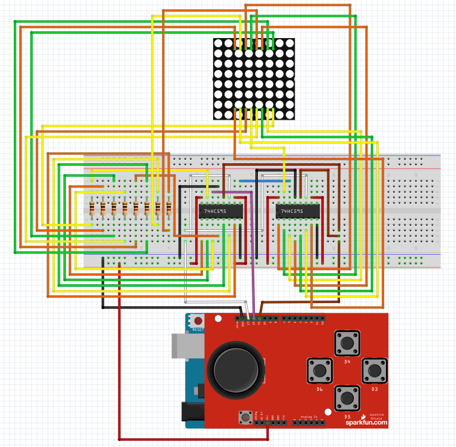

# Projeto com Matriz de LED 8x8

## Descrição Geral

Tela de desenho utilizando uma matriz de LED's 8x8 com controle feito por um shield joystick para arduíno.

São utilizados 7 botões, 4 para controle do cursor nas 4 direções cardeais, 1 para apagar/acender o LED onde o cursor está selecionado, 1 para "limpar" a tela apagando todos os LED's e o último botão inverte todos os LED's onde todos que estão apagados ficam acesos e todos que estão acesos apagam.

---

## Estrutura geral

O projeto está dividido em três partes:

  Matrix8x8.h → Arquivo de cabeçalho
    Declara a classe que controla a matriz 8×8.

  Matrix8x8.cpp → Implementação da biblioteca
    Contém o código que realmente envia os dados para a matriz de LEDs.

  Projeto_Final.ino → Programa principal
    Usa a biblioteca para criar um sistema com um cursor que acende LEDs na matriz usando botões com debounce.

---

## Estrutura da biblioteca

A estrutura completa da biblioteca está presente na pasta da mesma, com exemplos e todos os arquivos necessários para pleno entendimento da estrutura.

---

## Estrutura do código

O programa controla uma matriz de LEDs 8×8 usando a biblioteca Matrix8x8, permitindo mover um cursor, acender LEDs e alternar modos de exibição usando botões com debounce.

Primeiro, define-se os pinos da matriz e dos botões, além de uma estrutura Debounce para eliminar ruídos mecânicos dos botões. Cada botão tem sua própria instância de debounce, e a função debounceRead() identifica mudanças reais no estado do botão.

A matriz é criada como um objeto Matrix8x8, e um array desenho[8] armazena quais LEDs foram acesos permanentemente. Variáveis x e y controlam o cursor, e um sistema simples faz o cursor piscar.

No setup(), a matriz é inicializada, os botões são configurados com INPUT_PULLUP, e o desenho começa apagado.

No loop(), cada botão é lido com debounce: quatro botões movem o cursor, um alterna o modo invertido, outro apaga toda a matriz, e outro acende/apaga um LED na posição atual do cursor. O cursor pisca a cada 300 ms.

Antes de exibir, o programa copia o desenho para um buffer temporário, adiciona o cursor (se estiver visível) e inverte tudo caso o modo invertido esteja ativo. Por fim, chama matriz.draw(buffer, 20) para mostrar o resultado na matriz.

## Estrutura do repositório

```
.
├── Diagrama/
│   ├── esquematico_matrix.fzz
│   └── Diagrama.png
├── Tela_matriz8x8/
|   └── Tela_matriz8x8.jpeg
├── Projeto_final.ino
└── README.md
```

---

## Lista de materiais

### **1 Matriz de LED's 8x8 1088AS**


### **2 Registradores de 8 bits 74HC595**


### **1 Shield Joystick para Arduíno Nokia 5110**


### **8 Resistores de 1K Ohms**


### **Jumpers**


### **Arduino UNO**


---

## Diagrama de montagem



### Explicação do diagrama

No circuito está conectado ambos os **registradores**, da **matriz de LED's** e dos **botões** do shield que aciona o sistema:

- Para a conexão correta da **matriz de LED's** foi utilizado como referência o datasheet do dispositivo, conforme a imagem anexa abaixo.

- A partir disso foi realizado a conexão com os **registradores** sendo o registrador 1 sendo utilizado para as colunas e o registrador 2 para as linhas.
  
- Para as colunas, antes de ser conectada a matriz, foi necessário antes a conexão com resistores (1K OHMS) para evitar superaquecimento da matriz.

- Dos registradores para o arduíno foram necessárias 3 conexões, sendo elas:
  Pino 12 (Data): Registrador 1.
  Pino 13: (Clock): Divisão para ambos os registradores.
  Pino 11: (Latch): Divisão para ambos os registradores.

  **OBS: O data do registrador 2, vem do pino 9 (Q7') do registrador 1**

- Do Arduino para o Shield, as conexões já são pré-definadas no próprio Shield, sendo elas:
  Pino 2: Botão de movimento para cima.
  Pino 3: Botão de movimento para direita.
  Pino 4: Botão de movimento para baixo.
  Pino 5: Botão de movimento para esquerda.

  **OBS: Para facilitar, utilizamos os mesmos sentidos já definidos dos botões.**

  Pino 6: Botão inferior da direita (Inverte a tela).
  Pino 7: Botão inferior da esquerda (Apaga a tela).
  Pino 8: Botão do joystick (Seletor).

---

## Projeto Montado


**Link do vídeo do projeto em funcionamento:** https://drive.google.com/file/d/19JlpvGKZUz-Afme4KnpF8WVKFUXJbKl6/view

---

## Problemas Encontrados

- Dificuldade em acertar a conexão correta da matriz com os registradores.

- Achar um documento que ensinava o funciomento pleno do shield Joytstick.

- Realização do Debounce pelo fato de serem utilizados vários botões.

---

## Referências

**Projeto base:** https://docs.arduino.cc/built-in-examples/display/RowColumnScanning/

**Referênicia do Shield:** https://aluno.escoladigital.pr.gov.br/sites/alunos/arquivos_restritos/files/documento/2023-06/aula19_joystick_shield_em_m2_v2.pdf

